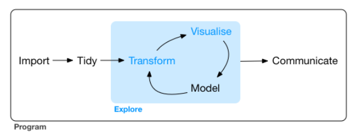

***

# Reproducible Analysis

Researcher degrees of freedom are an issue in disciplines that rely heavily on fairly complicated statistical analysis. There are many different ways a dataset can be analysed, which can produce qualitatively different results (see [Many analysts, one dataset](https://journals.sagepub.com/doi/10.1177/2515245917747646)). A way to combat this is to create reproducible workflows, so that given the files and analytical techniques used a result can be replicated and thus critiqued.

[Hadley Wickam's](http://hadley.nz/) amazing book [R for Data Science](https://r4ds.had.co.nz/) has the following image of the workflow:



## Data Import

Read the book for a much more developed workflow practice. The information contain here is a quick and dirty way to get set up data import, the first stage of the workflow, a stage that is confusing and daunting given the many different applications that exist to assist in streamlining and data sharing.

I will walk through three topics:

1. R Projects

2. Packrat

3. Github  


### Projects

R Projects are amazing. Use them. They will save you time and allow you to organise all your work so that you, or anyone else, can pick up where you left off without any key files missing. There is great synergy between R projects, Packrat and GitHub, such that you should be able to import, analyse and share data and code that clearly illustrates what you are trying to do; great for collaboration and great for reporducibility.

[Projects](https://support.rstudio.com/hc/en-us/articles/200526207-Using-Projects) allow one to use relative file addresses, such as `Temporal_data.csv`, which allows for ease of reproducibilty. Projects automatically set the working directing to project folder. This allows us to ue relative file addresses so we don't have to specify what folder to look in on the computer for the dataset. If we have all the files of interest in the project folder, we can just call the name of the datafile and not have to specify where to look. 

Why is this useful? Well consider if you sent your datafiles and scipts to someone else. They are going to have a different storage system to you, they're unlikely to have folders laid out like `/PhD/Data/Dimensions of Natural Capital/Transect Data/Nat_Cap_Dim_Transect_Data.csv"`. So instead we organise our files into one project folder, use relative addresses and send the whole project folder over to our friend. They will then be able to open up a script and get straight to work, no messing around with looking for files.

```{r}
#relative address
temporal <- read.csv("Temporal_data.csv")

#absolute address, wont be transferable and so hinders ease of reproducibility
Transect <- read.csv("~/PhD/Data/Dimensions of Natural Capital/Transect Data/Nat_Cap_Dim_Transect_Data.csv")
```


### Packrat

Packages make life so much easier, sharing functions and code allows analyses to proceed incredibly fast, once you know what to do. An issue for reproducibility though is that packages change over time, perhaps a function is changed to do something slightly different and years later when you go to reproduce some work, this could produce a different result. Packrat gets around this issue.

[Packrat](http://rstudio.github.io/packrat/) is a dependency management tool that allows each project to have it's own package folder, or **private package library**. It notes what version of the package has been used, so that if an analysis is reproduced years later, it will install the version of the package that was used when the analysis took place.


> Isolated: Installing a new or updated package for one project won’t break your other projects, and vice versa. That’s because packrat gives each project its own private package library.

>Portable: Easily transport your projects from one computer to another, even across different platforms. Packrat makes it easy to install the packages your project depends on.

>Reproducible: Packrat records the exact package versions you depend on, and ensures those exact versions are the ones that get installed wherever you go.

To set up Packrat: got to `Packages` tab and look for `Packrat` sub tab. You may need to update R studio for this to appear. Click on the packrat tab and check the box to use Packrat with this project.

Now all the packages for this project are stored in a folder for this project. Great.

### GitHub

GitHub is a repository for code. It is useful as just that, a repository for all your code, which you can access from anywhere. It's main advantage over other cloud storage services is that it is built to assist in collaboratively working on projects together. Very useful in the computer programming worlds, but also useful when working on data analysis.

Github works off repositories, basically the same as projects in R. All the filed related to one project are stored in a repositroy.

#### Introduction to Git

If you are new to Github it can be quite confusing. I was, and still am, a beginner, but I can now see why it can be useful and am eager to keep using it for all of my projects. For an introduction check out this  [tutorial](https://guides.github.com/activities/hello-world/).

Further tutorials

* [learn Git](https://try.github.io/)  

   More advanced:  
* [Git cheatsheet](https://github.com/tiimgreen/github-cheat-sheet)  
* [Git and websites](http://jmcglone.com/guides/github-pages/)  
* [Hubspot](https://product.hubspot.com/blog/git-and-github-tutorial-for-beginners)  

For our purposes it will mostly be a reposisitory for code and allow ease of collaboration on analysis, but it can be used for alot more besides.

#### Setting up Git with an R project:

It should be possible to set up git with an already existing project, yet when I do this I can't connect to my online github account. I haven't figured out why yet. So what I do is create a new project that uses Git from the start and then copy over any folders I want into the new Git initiated R project.

1. Create a `new project` (top right tab in the R studio user interface)  
2. Choose `Version Control` option (the third option)  
3. Choose the local library on your computer where you would like to create the folder, I use the same address as the R project I created above and just make a new folder within that.  
4. On your git hub account, create a new repository (green button on the right hand side of the repository sreen).  
5. Name the repository whatever you would like, good to keep the names of the R project and Git repo the same.  
6. Copy and paste the URL of the newly created repo into the URL section of the New Project window in R Studio.  
7. Finally, copy and paste all the files from the R project folder into the newly created Git enabled R project folder.  

Now that the project is set up and connected to your online github profile you can commit all the files in the R project and then push them to the master branch online (read this as uploading the project).

1. In the top right panel of R studio go to the `Git` tab.  
2. As this is the first time we are commiting (uploading) files, click on the `commit` sub tab  
3. 


## Tidy Data


Tidy Data
```{r}
#install.packages("kableExtra")
#library(kableExtra)
kable(head(temporal)) %>%
  kable_styling(bootstrap_options = c("striped", "hover"))

#data is not tidy, each row is multiple observations, need to create a month variable.
#install.packages("tidyr")
library("tidyr")

kable(temporal[1:2,] %>%
  pivot_longer(c("May", "June", "July", "August"), names_to = "month", values_to ="size", names_ptypes = list(month = factor()))) %>%
  kable_styling(bootstrap_options = c("striped", "hover"))
```


## Visualisation


An example of using ggplot
```{r}
#setting my palette
urbanpalette <- c("#4575B4","#74ADD1","#ABD9E9", "grey",
                 "grey","grey","grey")

#setting factor levels so they will be displayed as such in legend
factor(temporal$level, levels = c("High Urban","Medium Urban","Low Urban","Semi Nat","Low Agricultural","Medium Agricultural","High Agricultural"))


#installing ggplot and loading library
#install.packages("ggplot2")
library("ggplot2")

temporal %>%
  pivot_longer(c("May", "June", "July", "August"), names_to = "month", values_to ="size", names_ptypes = list(month = factor())) %>%
  ggplot( aes(x=month, y=size)) +
    geom_jitter(aes(col=level), size = 3, width = 0.1) +
       scale_colour_manual(values= urbanpalette) +
       coord_cartesian(ylim=c(0,150)) +
       labs(title = "", y="Size", x="", caption = "") +
        theme_bw()
```
